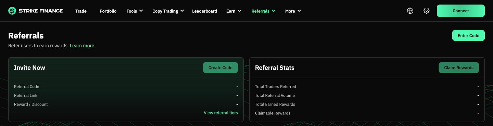
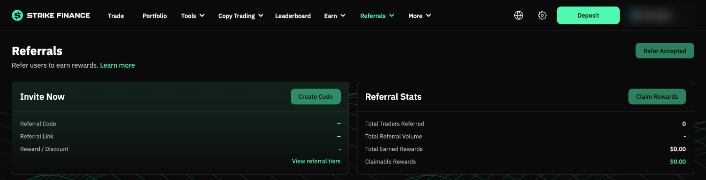
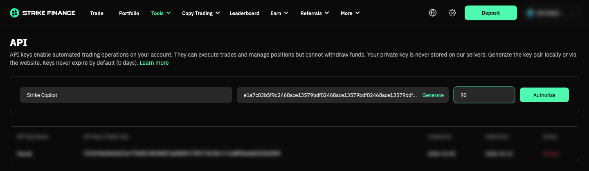
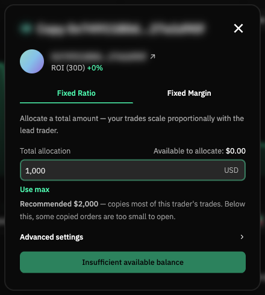
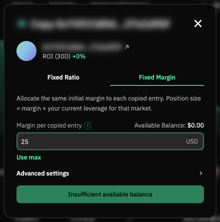
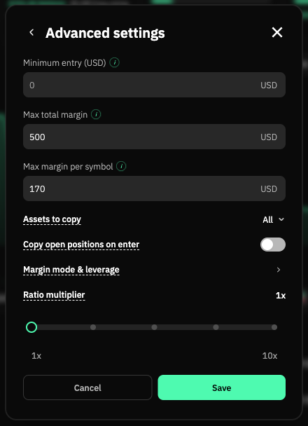
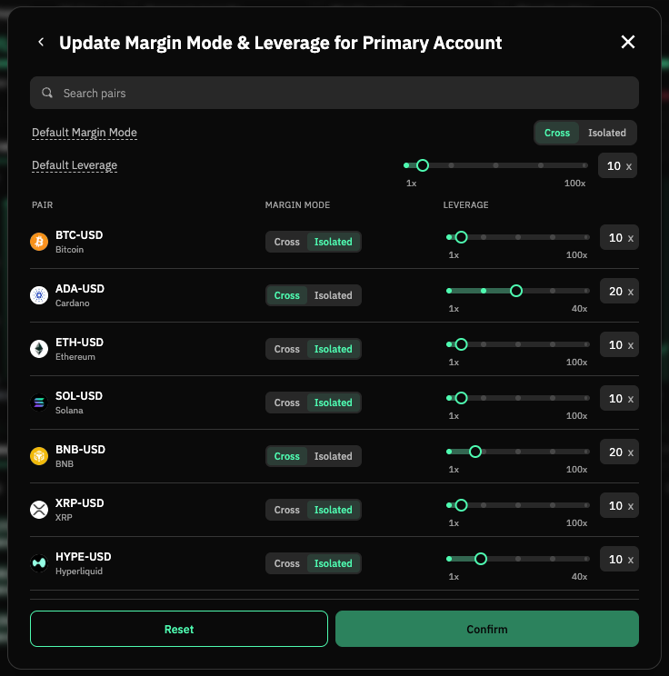

# Strike Copilot

Review your Strike Finance copy-trading account, find traders worth copying, and set copies up sensibly, by
chatting with Claude.

> **General information only, not financial advice.** Copy trading can lose money quickly, including through
> liquidations. Past results don't predict future ones. Only use money you can afford to lose.
> This project is independent and not affiliated with Strike Finance.

---

## Contents
1. [What this does (and doesn't)](#1-what-this-does-and-doesnt)
2. [Disclosure](#2-disclosure)
3. [What you need](#3-what-you-need)
4. [Install](#4-install)
5. [Set up your API key safely](#5-set-up-your-api-key-safely)
6. [Your first review](#6-your-first-review)
7. [Reading your results](#7-reading-your-results)
8. [Setting up a copy](#8-setting-up-a-copy)
9. [Regular reviews](#9-regular-reviews)
10. [Prompt cookbook](#10-prompt-cookbook)
11. [Troubleshooting and FAQ](#11-troubleshooting-and-faq)
12. [Privacy](#12-privacy)

---

## 1. What this does (and doesn't)

Strike ([app.strikefinance.org](https://app.strikefinance.org)) lets you copy traders: Hyperliquid wallets that
Strike mirrors, and traders on Strike itself. Picking who to copy, and how, is the hard part. Strike's own
leaderboard numbers include things a copier never gets (like spot trading), so they flatter some traders.

This repo gives Claude the tools and rules to:

- **Check traders properly**: it reads each trader's actual trades and replays them as if you had copied them,
  with your own fees, leverage and limits.
- **Sweep** thousands of traders and shortlist the few that fit your account.
- **Compare the two copy modes** (fixed margin and fixed ratio) on the same trader and tell you which did better.
- **Recommend settings**: how much per trade, caps, which markets to exclude, what leverage to lock first.
- **Set the copy up for you** (only after you say yes to each change) or give you the steps to do it yourself.
- **Review your account** each week and flag anything that needs a decision.

It **never**:
- places, changes or cancels your own trades
- withdraws or moves your funds (Strike API keys can't, by design)
- makes any change without showing you exactly what it will send and getting your "yes"
- sends your data anywhere except Strike and Hyperliquid's public APIs

## 2. Disclosure

The author shares a referral code (`BenRyan`). If your account has **no** referral discount yet, setup asks you
**once** whether you'd like to use it. It gives you a discount on Strike's trading fees, and the author earns a
share of those fees. It's optional: say no and you'll never be asked again, and everything works the same.
If you say yes, you apply it yourself in one of two ways: open
[app.strikefinance.org/trade/BTC?referralCode=BenRyan](https://app.strikefinance.org/trade/BTC?referralCode=BenRyan)
while logged in to Strike, or press **Enter Code** on the Referrals page and type `BenRyan`. The tool can't set a
referral code itself (Strike only allows that in the app), and it never touches a code you already have.

Once a code is linked, the button at the top right of the Referrals page changes from **Enter Code** to
**Refer Accepted**:




More trading volume also helps the author's referral tier. So whenever the recommended copy mode trades more volume
than the other one, the result says so, with both volumes. The choice itself follows the rule in section 7.

## 3. What you need

- **A Strike account** with a connected wallet, and the money you plan to copy with.
- **Claude Code**, Anthropic's coding assistant, which runs in a terminal or desktop app. It needs a Claude
  subscription (Pro or Max) or an Anthropic API account. Install guide: [claude.com/code](https://claude.com/code).
- **Python 3.10 or newer**.
  - Mac: open Terminal and type `python3 --version`. If it's missing or older than 3.10, install it from
    [python.org/downloads](https://www.python.org/downloads/).
  - Windows: install from [python.org/downloads](https://www.python.org/downloads/) and tick **"Add Python to PATH"**
    during install. Windows 10 and 11 already include `curl`, which the tool also uses.
- About **30 minutes** for the first run (most of it is the sweep running by itself).

## 4. Install

**Option A, with git** (makes updating easy):
1. Open Terminal (Mac) or PowerShell (Windows).
2. Run:
   ```
   git clone https://github.com/benryandev/strike-copilot.git
   cd strike-copilot
   python3 -m pip install -r requirements.txt
   ```
   (On Windows, use `python` instead of `python3` if `python3` isn't found.)

**Option B, without git:**
1. On the GitHub page, click the green **Code** button, then **Download ZIP**.
2. Unzip it somewhere you'll find again, e.g. your Documents folder.
3. Open Terminal/PowerShell in that folder and run `python3 -m pip install -r requirements.txt`.

<!-- screenshot: GitHub Code button > Download ZIP -->

**Start Claude in the folder:**
1. In the same Terminal window (inside the `strike-copilot` folder), type `claude` and press Enter.
   Or open the folder in the Claude desktop app.
2. Type: **`Set me up`**

Claude takes it from there, one step at a time.

## 5. Set up your API key safely

The tool talks to Strike through an **API key**, a pair of keys made on your own computer:
- the **public key**, which you paste into Strike (safe to share)
- the **private key**, which stays in a hidden file in this folder (`.secrets/strike_api.key`) and is never shown,
  sent anywhere, or pasted into chat

What happens:
1. Claude runs `python3 scripts/strike_api.py keygen` and shows you the public key.
2. Open [app.strikefinance.org/api-keys](https://app.strikefinance.org/api-keys) while logged in to Strike (wallet or email login both work).
3. Fill in the form at the top: a name (e.g. "Strike Copilot"), the public key Claude showed you, and **Days to
   expire** (we suggest 90; leave it empty and the key never expires). Press **Authorize**.
   **Don't press "Generate"**: that makes a key in your browser, and the tool would never get the private half.

   
4. Tell Claude "done". It checks the key works (`strike_api.py whoami`).

**What the key can do:** read your account, change leverage and margin settings, and manage copy subscriptions.
Strike labels these keys as able to trade, but **they can't withdraw funds**. This tool deliberately doesn't wire up
any trading of your own positions.

**If you set an expiry,** the key stops working on that date and Claude will tell you it was refused. Delete the old key on the Strike page,
delete `.secrets/strike_api.key`, and say "set me up" again.

**Never paste a private key or a wallet seed phrase into any chat**, including this one. If you ever do, treat it as
exposed: delete that API key on Strike (or move funds to a new wallet, for a seed phrase).

**Tip:** create a **sub-account** in Strike just for copying. It keeps copies separate from anything you trade
yourself, and caps the damage if something goes wrong.

## 6. Your first review

After the key, Claude asks a few multiple-choice questions (pick an answer, or choose "Other" to type your own). Each one changes the recommendations:

| Question | Why it matters | Typical answer |
|---|---|---|
| How much will you fund the copy account with? | Sizes every trade and cap | $250 – $5,000 |
| What leverage on every market? | Higher means liquidations come sooner | 10x |
| How much of the balance in open copies at once, at most? | Becomes your total cap | Half |
| If the account dipped from its high, how big a dip could you sit through? | Traders who dipped further in replays get flagged | 20% |
| Any markets to never copy? | Thin or meme markets slip more | e.g. PUMP-USD |
| Isolated or cross margin? | Isolated: each copy can only lose its own margin. Cross: copies share the balance, fewer single liquidations but more at stake | Isolated |
| Preferred copy mode? | Breaks ties your way | No preference |
| Which day each week to review? | Your weekly check-in | Monday |

Your answers are saved in `profile.json` in this folder (only on your computer). Change them any time:
"change my balance to $2,000".

Then say **"Run a sweep"**. It checks thousands of traders and takes 20–30 minutes. You can leave it running.

## 7. Reading your results

For each shortlisted trader you get a table like this (example numbers):

```
== 0x1a2b...9f0e ==  active copiers 1/40
  window   mode               net    lowest       max drop   margin used    fees     volume  skipped
  90d      FM $55          +1,709       861     -327 (-33%)          574      54    107,480  -
  90d      FR $1,000         +422       964     -107 (-11%)          175      12     24,581  1 tiny
           -> fixed margin: more profit per $ of drawdown (5.2 vs 3.9)
  30d      FM $55            +498       941     -262 (-26%)          574      11     22,498  -
  30d      FR $1,000          +66       983      -35 ( -3%)          118       2      3,315  -
           -> fixed ratio: profit per $ of drawdown about even (1.9 vs 1.9): smaller drawdown wins
  VERDICT: FIXED MARGIN -> 90d: more profit per $ of drawdown (5.2 vs 3.9); 30d: profit per $ of drawdown about even ...
```

- **FM / fixed margin**: every trade the lead opens is copied with the same dollar margin (here $55).
- **FR / fixed ratio**: copies are scaled to the lead's size compared with their account (here 0.48% of theirs).
- **net**: profit after your fees, as if you'd copied for the last 90 (or 30) days.
- **lowest**: the lowest your balance went. **max drop**: the biggest fall from a high point.
- **margin used**: the most money tied up in open copies at once.
- **skipped**: copies that wouldn't have happened (cap reached, below Strike's minimum order, not enough free margin).

**How the mode is chosen:** both modes are scored on **profit per dollar of drawdown** (net profit divided by the
biggest drop). A smaller drop compounds better: a mode with half the drop and half the profit can be sized up to
match the other, while a deep drop is hard to recover from and hard to sit through.
- The mode with clearly more profit per dollar of drawdown wins.
- If they're within 10% of each other, the one with the **smaller drawdown** wins.
- A clear win in one period beats a tie in the other. If the 90-day and 30-day results clearly pick different modes,
  the smaller 90-day drawdown wins, and the result tells you the periods disagreed.
- If only one mode made money, it wins. If both lost money in either period, neither is recommended.

Every recommendation also lists the **settings**: margin per entry (or copy amount), how many entries the trader
tends to hold at once, caps, excluded markets, and the leverage to lock on their markets **before** you start.

## 8. Setting up a copy

Say **"Set it up"**. Claude asks whether to do it through the API or give you the steps.

**Through the API:** Claude shows each change before sending it, e.g.:
```
POST /v2/copy/subscribe
{"lead_account_id": "0x1a2b...", "copy_mode": "fixed_amount", "margin_per_entry_order": "55", ...}
DRY RUN: nothing sent. Add --yes to send it.
```
Nothing is sent until you pick "Make this change". Order of steps: set your margin mode and leverage on the
trader's markets, then subscribe (with both caps and your excluded markets).

**Yourself in the app:** Claude gives numbered steps with your exact numbers, using these screens. On the trader's
page press **Copy**, then choose a tab:

| Fixed ratio: a total allocation | Fixed margin: the same margin per copied entry |
|---|---|
|  |  |

The button reads **Insufficient available balance** until the account is funded: Strike won't start a copy larger
than your balance. Once funded it reads **Confirm Copy**.

**Advanced settings** holds the caps, the markets to copy, and (fixed ratio only) Minimum entry and Ratio
multiplier. Leave those two at 0 and 1x unless Claude has shown you what they change.



**Margin mode & leverage** (the arrow in Advanced settings) sets every market on one screen. Copies use *your*
settings for each market, not the trader's, and Strike's defaults are often Cross 20x, so set these first.



Your first copy lands on the trader's **next** trade. Their positions that are already open aren't copied.

## 9. Regular reviews

Once a week (your review day) say **"Review my account"**. Claude:
- checks for a newer version of this repo and asks before updating
- checks whether Strike changed its API
- shows your balance, drop from peak, each copy's profit and loss, and what each trader did
- flags only what needs a decision: you're past your drawdown limit, a trader has gone idle, a trader's profits have
  moved to markets Strike doesn't list, a copy was force-closed, or a market's leverage drifted from your setting

Do an extra review after a big loss, a liquidation, or any change you make.

## 10. Prompt cookbook

Copy and paste these into Claude inside the `strike-copilot` folder.

| You want to... | Say |
|---|---|
| Start from scratch | `Set me up` |
| Find traders for my account | `Run a sweep and show me the best 3` |
| Check one trader | `Check this trader: 0x...` |
| Fixed margin or fixed ratio? | `Compare fixed margin and fixed ratio for 0x...` |
| Choose caps | `What caps should I set for my copy of 0x...? Show me a comparison` |
| Set caps myself in the app | `Show me how to set caps manually in the Strike app` |
| Set up a copy | `Set up the copy for 0x... using fixed margin` |
| Weekly check | `Review my account` |
| Stop copying someone | `Stop my copy of 0x... and keep the open positions` |
| Change my settings | `Change my balance to $2,000 and exclude PUMP-USD` |
| Update the tool | `Check for updates` |

## 11. Troubleshooting and FAQ

**"The key was refused"**: the key expired, wasn't saved on Strike, or was deleted. Make a new one (section 5).

**"command not found: python3"**: Python isn't installed or isn't on PATH. Reinstall from python.org (on Windows,
tick "Add Python to PATH"). On Windows, also try `python` instead of `python3`.

**"No module named cryptography"**: run `python3 -m pip install -r requirements.txt`.

**"Hyperliquid gave no answer ... rate limit"**: Hyperliquid limits how fast anyone can ask for data. Wait a
minute and run it again. Sweeps pick up where they stopped.

**SSL or certificate errors on Mac**: the tool uses `curl` for all web requests to avoid Python's certificate issues.
If curl itself fails, check your internet connection or VPN.

**Why does a trader with great Strike numbers fail the checks?** Strike's figures include spot trading and markets
Strike can't copy, and a fast trader's small edge disappears once copy costs (fees plus price differences) are paid.
The checks only count what a copier would actually get.

**How do I remove everything?** Delete the API key on Strike's API keys page, then delete this folder. Nothing is
installed elsewhere except the `cryptography` Python package.

**Does this cost anything?** The tool is free. Claude Code needs a Claude subscription or API credit. Strike charges its
normal trading fees on copies.

## 12. Privacy

Stays on your computer only: your private key (`.secrets/`), your answers (`profile.json`), and all results (`data/`).
These are excluded from git, so they're never uploaded even if you push a copy of this repo.

The tool reads public data from Strike (`api.strikefinance.org`) and Hyperliquid (`api.hyperliquid.xyz`), and your
own account from Strike using your key. Nothing is sent to the author, and there's no tracking.

---

MIT licence. Not affiliated with Strike Finance or Hyperliquid. General information only, not financial advice.
